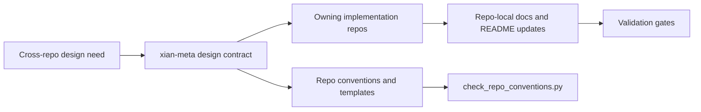

# xian-meta

`xian-meta` is the shared standards repo for the `xian-technology` workspace.
It defines the conventions, change-workflow rules, and cross-repo design
contracts that keep the main Xian repositories consistent without forcing every
repo to re-document the same patterns.

This repo holds *standards* and *cross-repo contracts*. It does not hold
runtime code, repo-local backlogs, or implementation details that belong to a
single owning repo.

## Standards Flow



## Quick Start

Open `docs/WORKSPACE.md` first if you are trying to understand the sibling
repo layout. Open `docs/REPO_CONVENTIONS.md` first if you are starting a new
repo, refactoring an existing one, or evaluating whether a doc belongs here or
in an implementation repo.

```bash
# Inspect the workspace front door and clone manifest
$EDITOR docs/WORKSPACE.md
$EDITOR workspace-repos.json

# Read the canonical structure rules
$EDITOR docs/REPO_CONVENTIONS.md

# Read the pre-push change discipline
$EDITOR docs/CHANGE_WORKFLOW.md

# Run lightweight workspace checks
python3 ./scripts/bootstrap_workspace.py --workspace-root .. --dry-run
python3 ./scripts/check_repo_conventions.py --workspace-root ..
python3 ./scripts/report_workspace_shas.py --workspace-root ..
```

Common entrypoints by question:

- *What should a root README or `AGENTS.md` look like?* → `docs/README_TEMPLATE.md`, `docs/FOLDER_README_TEMPLATE.md`
- *What runs before push?* → `docs/CHANGE_WORKFLOW.md`
- *Where should a cross-repo design live?* → here, then implement in the owning repo
- *What network is ready for public launch?* → `docs/MAINNET_LAUNCH_PLAN.md`
- *What is the compiler/runtime launch status?* → `docs/COMPILER_RUNTIME_LAUNCH_STATUS.md`
- *What is Xian for, strategically?* → `docs/XIAN_MISSION_AND_PRODUCT_STRATEGY.md`

## Principles

- **Standards, not implementations.** Anything that defines how Xian repos
  should be structured, validated, or coordinated belongs here. Anything that
  implements behavior belongs in the owning repo.
- **Shared contracts go here first.** When a design spans multiple repos
  (protocol, architecture, workflow), the contract is written here before any
  implementation is started.
- **Repo-local notes stay local.** Internal redesign plans, repo-specific
  follow-ups, and one-repo backlogs belong in that repo's `docs/BACKLOG.md`.
- **Consistency over novelty.** New documentation patterns are introduced here
  before they spread to other repos.
- **Human-first.** READMEs and folder entrypoints are optimized for an engineer
  evaluating or using the repo professionally, not for changelogs or AI-only
  consumption.

## Key Directories

- `docs/` — shared conventions, change-workflow rules, and cross-repo design
  notes. The files in this folder are the authoritative source for repo
  structure, README shape, validation gates, and stack-wide protocol designs.
- `scripts/` — lightweight workspace-wide checks. The
  `check_repo_conventions.py`, `bootstrap_workspace.py`, and
  `report_workspace_shas.py` scripts validate conventions, inspect clone
  layout, and make sibling-SHA resolution visible.
- `workspace-repos.json` — canonical manifest for sibling repos, convention
  tiers, default clone policy, and explicit exemptions.

## Validation

```bash
python3 ./scripts/bootstrap_workspace.py --workspace-root .. --dry-run
python3 ./scripts/check_repo_conventions.py --workspace-root ..
python3 ./scripts/report_workspace_shas.py --workspace-root ..
```

The checker walks the workspace root, resolves the main `xian-*` repos, and
reports any deviations from the required-root-files and folder-README rules
defined in `docs/REPO_CONVENTIONS.md`.

## Related Docs

- [AGENTS.md](AGENTS.md) — repo guidelines for AI agents and contributors
- [workspace-repos.json](workspace-repos.json) — sibling repo manifest and convention tiers
- [docs/WORKSPACE.md](docs/WORKSPACE.md) — progressive-disclosure workspace front door
- [docs/ARCHITECTURE.md](docs/ARCHITECTURE.md) — what `xian-meta` owns and what it intentionally excludes
- [docs/BACKLOG.md](docs/BACKLOG.md) — open work on the standards repo itself
- [docs/REPO_CONVENTIONS.md](docs/REPO_CONVENTIONS.md) — canonical repo structure standard
- [docs/CHANGE_WORKFLOW.md](docs/CHANGE_WORKFLOW.md) — pre-push docs-impact and validation gates
- [docs/MAINNET_LAUNCH_PLAN.md](docs/MAINNET_LAUNCH_PLAN.md) — future public-network launch checklist
- [docs/COMPILER_RUNTIME_LAUNCH_STATUS.md](docs/COMPILER_RUNTIME_LAUNCH_STATUS.md) — current compiler/runtime launch status
- [docs/README_TEMPLATE.md](docs/README_TEMPLATE.md) — root README shape used by the main repos
- [docs/FOLDER_README_TEMPLATE.md](docs/FOLDER_README_TEMPLATE.md) — short per-folder entrypoint template
- [docs/XIAN_MISSION_AND_PRODUCT_STRATEGY.md](docs/XIAN_MISSION_AND_PRODUCT_STRATEGY.md) — shared mission, principles, and product direction
- [docs/README.md](docs/README.md) — index of every cross-repo design note maintained here
